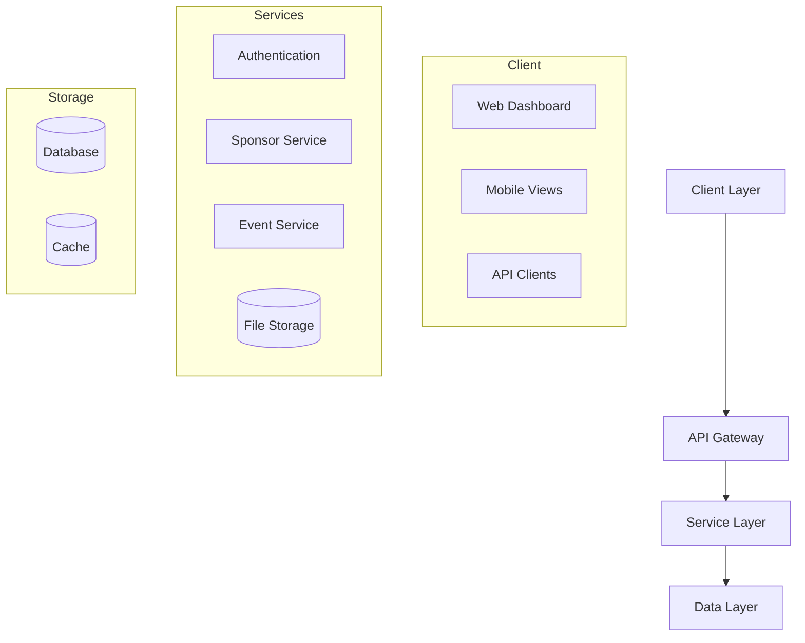
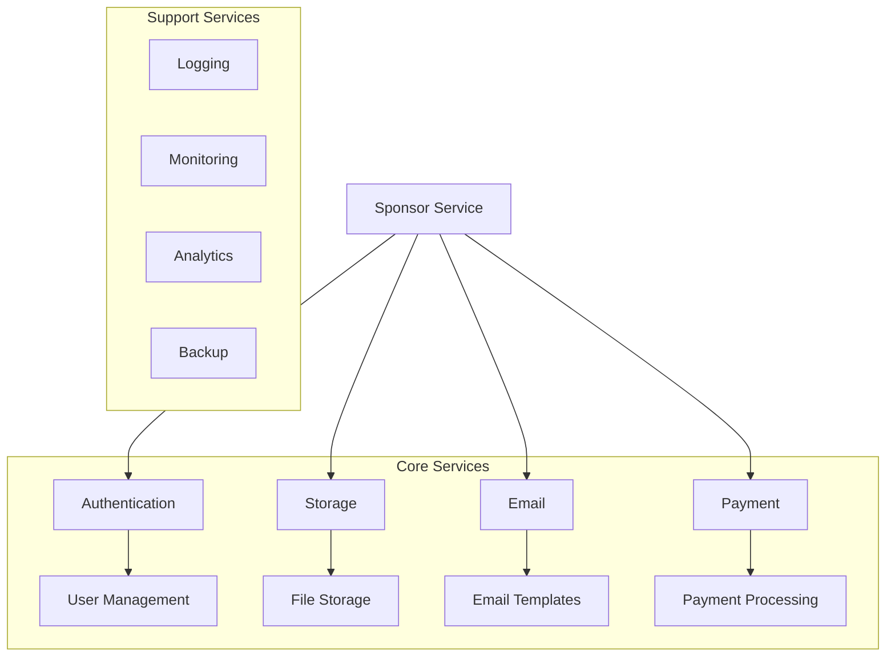

# Sponsor Management Setup Guide

## Table of Contents
- [System Architecture](#system-architecture)
- [Data Layer](#data-layer)
- [UI/UX Implementation](#uiux-implementation)
- [API Structure](#api-structure)
- [Core Features](#core-features)
- [Security Framework](#security-framework)
- [Performance Optimization](#performance-optimization)
- [Testing & Deployment](#testing--deployment)
- [Monitoring & Maintenance](#monitoring--maintenance)
- [Disaster Recovery](#disaster-recovery)
- [Documentation & Training](#documentation--training)

## System Architecture

### Core Architecture
```typescript
// Core system interfaces
interface SponsorSystem {
  readonly config: SystemConfig;
  readonly services: ServiceRegistry;
  readonly state: StateManager;
  readonly security: SecurityManager;
}

interface SystemConfig {
  environment: Environment;
  features: FeatureFlags;
  scaling: ScalingConfig;
  monitoring: MonitoringConfig;
}

interface ServiceRegistry {
  database: DatabaseService;
  cache: CacheService;
  storage: StorageService;
  messaging: MessagingService;
  search: SearchService;
}
```

### Data Flow


### Integration Points
```typescript
interface IntegrationConfig {
  endpoints: {
    auth: AuthEndpoint;
    api: APIEndpoint;
    webhook: WebhookEndpoint;
    socket: WebSocketEndpoint;
  };
  services: {
    payment: PaymentService;
    email: EmailService;
    storage: StorageService;
    analytics: AnalyticsService;
  };
}
```

### Additional System Components
```typescript
interface ErrorHandling {
  logger: LoggerConfig;
  monitoring: MonitoringConfig;
  alerting: AlertConfig;
  recovery: RecoveryStrategy;
}

interface BackupSystem {
  schedule: BackupSchedule;
  retention: RetentionPolicy;
  verification: VerificationProcess;
  restoration: RestorationProcedure;
}

interface MetricsCollection {
  performance: PerformanceMetrics;
  business: BusinessMetrics;
  technical: TechnicalMetrics;
  custom: CustomMetrics;
}
```

### Detailed Service Dependencies


## Data Layer

### Enhanced Database Schema
```sql
-- Core sponsor tables
CREATE TABLE sponsors (
  id UUID PRIMARY KEY DEFAULT uuid_generate_v4(),
  name TEXT NOT NULL,
  status SPONSOR_STATUS NOT NULL,
  created_at TIMESTAMPTZ DEFAULT NOW(),
  updated_at TIMESTAMPTZ DEFAULT NOW()
);

-- Sponsor details
CREATE TABLE sponsor_details (
  sponsor_id UUID PRIMARY KEY REFERENCES sponsors(id),
  company_info JSONB NOT NULL,
  preferences JSONB,
  settings JSONB,
  metadata JSONB
);

-- RLS Policies
ALTER TABLE sponsors ENABLE ROW LEVEL SECURITY;

CREATE POLICY sponsor_read_policy ON sponsors
  FOR SELECT USING (
    auth.uid() IN (
      SELECT user_id FROM sponsor_members 
      WHERE sponsor_id = id
    )
  );

-- Sponsor events table
CREATE TABLE sponsor_events (
  id UUID PRIMARY KEY DEFAULT uuid_generate_v4(),
  sponsor_id UUID REFERENCES sponsors(id),
  event_type EVENT_TYPE NOT NULL,
  status EVENT_STATUS NOT NULL,
  start_date TIMESTAMPTZ NOT NULL,
  end_date TIMESTAMPTZ NOT NULL,
  budget DECIMAL(10,2),
  CONSTRAINT valid_dates CHECK (end_date > start_date)
);

-- Sponsor contacts table
CREATE TABLE sponsor_contacts (
  id UUID PRIMARY KEY DEFAULT uuid_generate_v4(),
  sponsor_id UUID REFERENCES sponsors(id),
  name TEXT NOT NULL,
  role TEXT NOT NULL,
  email TEXT NOT NULL,
  phone TEXT,
  is_primary BOOLEAN DEFAULT false,
  CONSTRAINT unique_primary_contact UNIQUE (sponsor_id, is_primary)
);

-- Sponsor documents table
CREATE TABLE sponsor_documents (
  id UUID PRIMARY KEY DEFAULT uuid_generate_v4(),
  sponsor_id UUID REFERENCES sponsors(id),
  type DOCUMENT_TYPE NOT NULL,
  status DOCUMENT_STATUS NOT NULL,
  url TEXT NOT NULL,
  uploaded_at TIMESTAMPTZ DEFAULT NOW(),
  expires_at TIMESTAMPTZ
);

-- Additional RLS Policies
CREATE POLICY sponsor_document_access ON sponsor_documents
  FOR ALL USING (
    auth.uid() IN (
      SELECT user_id FROM sponsor_members 
      WHERE sponsor_id = sponsor_id AND 
      permission_level >= 'document_access'
    )
  );
```

### Data Migration Strategy
```typescript
interface MigrationStrategy {
  steps: {
    preMigration: PreMigrationCheck[];
    migration: MigrationStep[];
    postMigration: PostMigrationValidation[];
  };
  rollback: RollbackProcedure;
  validation: ValidationSteps;
}

interface DataValidation {
  rules: ValidationRule[];
  constraints: DataConstraint[];
  cleanup: CleanupProcedure[];
}
```

## UI/UX Implementation

### Layout Structure
```typescript
interface LayoutConfig {
  sidebar: SidebarConfig;
  header: HeaderConfig;
  main: MainContentConfig;
  footer: FooterConfig;
}

interface SidebarConfig {
  navigation: NavigationItem[];
  collapse: CollapseConfig;
  width: ResponsiveWidth;
}
```

### Component Architecture
```typescript
// Core components
interface SponsorComponents {
  cards: {
    sponsor: SponsorCard;
    event: EventCard;
    stats: StatsCard;
  };
  forms: {
    creation: CreationForm;
    edit: EditForm;
    filters: FilterForm;
  };
  tables: {
    list: ListView;
    grid: GridView;
    calendar: CalendarView;
  };
}
```

### Responsive Design
```typescript
interface ResponsiveConfig {
  breakpoints: {
    mobile: string;
    tablet: string;
    desktop: string;
    wide: string;
  };
  layouts: {
    [key in DeviceType]: LayoutConfig;
  };
}
```

### Detailed Component Specifications
```typescript
interface SponsorDashboard {
  layout: {
    header: HeaderComponent;
    sidebar: SidebarComponent;
    mainContent: MainContentArea;
    footer: FooterComponent;
  };
  features: {
    search: SearchComponent;
    filters: FilterComponent;
    sorting: SortingComponent;
    pagination: PaginationComponent;
  };
  interactions: {
    dragDrop: DragDropConfig;
    contextMenu: ContextMenuConfig;
    tooltips: TooltipConfig;
    modals: ModalConfig;
  };
}

interface FormComponents {
  inputs: {
    text: TextInputConfig;
    select: SelectConfig;
    multiSelect: MultiSelectConfig;
    datePicker: DatePickerConfig;
    fileUpload: FileUploadConfig;
  };
  validation: {
    rules: ValidationRules;
    messages: ValidationMessages;
    styles: ValidationStyles;
  };
  submission: {
    handlers: SubmissionHandlers;
    progress: ProgressIndicators;
    success: SuccessHandlers;
    error: ErrorHandlers;
  };
}
```

### Accessibility Implementation
```typescript
interface AccessibilityConfig {
  aria: AriaAttributes;
  keyboard: KeyboardNavigation;
  contrast: ContrastSettings;
  screenReader: ScreenReaderConfig;
  focusManagement: FocusConfig;
}
```

## API Structure

### RESTful Endpoints
```typescript
interface APIEndpoints {
  sponsors: {
    base: '/api/v1/sponsors';
    methods: {
      list: GETConfig;
      create: POSTConfig;
      update: PUTConfig;
      delete: DELETEConfig;
    };
  };
  events: {
    base: '/api/v1/events';
    methods: {
      list: GETConfig;
      create: POSTConfig;
      update: PUTConfig;
      delete: DELETEConfig;
    };
  };
}
```

### GraphQL Schema
```graphql
type Sponsor {
  id: ID!
  name: String!
  status: SponsorStatus!
  details: SponsorDetails!
  events: [Event!]!
  metrics: SponsorMetrics
}

type Query {
  sponsors(filter: SponsorFilter): [Sponsor!]!
  sponsor(id: ID!): Sponsor
  sponsorMetrics(id: ID!): SponsorMetrics!
}

type Mutation {
  createSponsor(input: CreateSponsorInput!): Sponsor!
  updateSponsor(id: ID!, input: UpdateSponsorInput!): Sponsor!
  deleteSponsor(id: ID!): Boolean!
}
```

## Core Features

### Enhanced Event Management
```typescript
interface EventWorkflow {
  stages: {
    planning: PlanningPhase;
    preparation: PreparationPhase;
    execution: ExecutionPhase;
    followup: FollowupPhase;
  };
  transitions: {
    conditions: TransitionCondition[];
    validators: TransitionValidator[];
    actions: TransitionAction[];
  };
  notifications: {
    triggers: NotificationTrigger[];
    templates: NotificationTemplate[];
    channels: NotificationChannel[];
  };
}
```

### Reporting System
```typescript
interface ReportingSystem {
  templates: ReportTemplate[];
  generators: ReportGenerator[];
  schedulers: ReportScheduler[];
  distributors: ReportDistributor[];
  formats: {
    pdf: PDFConfig;
    excel: ExcelConfig;
    csv: CSVConfig;
  };
}
```

## Security Framework

### Enhanced Security Features
```typescript
interface SecurityConfig {
  authentication: {
    methods: AuthMethod[];
    mfa: MFAConfig;
    passwordPolicy: PasswordPolicy;
    sessionManagement: SessionConfig;
  };
  authorization: {
    rbac: RBACConfig;
    permissions: PermissionConfig;
    policies: SecurityPolicy[];
  };
  encryption: {
    atRest: DataEncryption;
    inTransit: TransitEncryption;
    keyManagement: KeyManagement;
  };
  compliance: {
    gdpr: GDPRConfig;
    audit: AuditConfig;
    logging: LoggingConfig;
  };
}
```

## Performance Optimization

### Caching Strategy
```typescript
interface CacheStrategy {
  layers: {
    browser: BrowserCache;
    api: APICache;
    database: DBCache;
  };
  policies: CachePolicy[];
  invalidation: InvalidationRules[];
}
```

### Query Optimization
```typescript
interface QueryOptimization {
  indexes: IndexConfig[];
  materialized: MaterializedViewConfig[];
  partitioning: PartitionConfig[];
}
```

## Testing & Deployment

### Test Strategy
```typescript
interface TestStrategy {
  unit: UnitTestConfig;
  integration: IntegrationTestConfig;
  e2e: E2ETestConfig;
  performance: PerformanceTestConfig;
}
```

### Deployment Pipeline
```typescript
interface DeploymentPipeline {
  environments: Environment[];
  stages: Stage[];
  validations: Validation[];
  rollback: RollbackStrategy;
}
```

## Monitoring & Maintenance

### System Monitoring
```typescript
interface MonitoringSystem {
  metrics: {
    performance: PerformanceMetrics;
    availability: AvailabilityMetrics;
    security: SecurityMetrics;
  };
  alerts: {
    triggers: AlertTrigger[];
    notifications: AlertNotification[];
    escalation: EscalationPolicy[];
  };
  logging: {
    levels: LogLevel[];
    storage: LogStorage;
    rotation: LogRotation;
  };
}
```

### Maintenance Procedures
```typescript
interface MaintenanceProcedures {
  scheduled: {
    daily: DailyTasks[];
    weekly: WeeklyTasks[];
    monthly: MonthlyTasks[];
  };
  automated: {
    cleanup: CleanupTasks[];
    optimization: OptimizationTasks[];
    verification: VerificationTasks[];
  };
  emergency: {
    procedures: EmergencyProcedure[];
    contacts: EmergencyContact[];
    recovery: RecoveryPlan[];
  };
}
```

## Implementation Steps

### 1. Initial Setup
1. Environment Preparation
   - [ ] Install required dependencies
   - [ ] Configure development environment
   - [ ] Set up version control
   - [ ] Configure CI/CD pipeline

2. Database Setup
   - [ ] Create database schemas
   - [ ] Set up migrations
   - [ ] Configure backup system
   - [ ] Implement data validation

3. Authentication Setup
   - [ ] Configure auth providers
   - [ ] Set up MFA
   - [ ] Implement session management
   - [ ] Configure password policies

### 2. Core Implementation
1. API Development
   - [ ] Create base endpoints
   - [ ] Implement CRUD operations
   - [ ] Set up middleware
   - [ ] Configure rate limiting

2. Frontend Development
   - [ ] Set up component library
   - [ ] Implement layouts
   - [ ] Create form components
   - [ ] Add data visualization

3. Feature Implementation
   - [ ] Sponsor management
   - [ ] Event tracking
   - [ ] Document management
   - [ ] Reporting system

### 3. Testing & Validation
1. Testing Setup
   - [ ] Unit test framework
   - [ ] Integration tests
   - [ ] E2E testing
   - [ ] Performance testing

2. Security Validation
   - [ ] Security audit
   - [ ] Penetration testing
   - [ ] Compliance checking
   - [ ] Vulnerability scanning

### 4. Deployment & Monitoring
1. Deployment Process
   - [ ] Staging deployment
   - [ ] Production deployment
   - [ ] Backup verification
   - [ ] Monitoring setup

2. Post-Deployment
   - [ ] System monitoring
   - [ ] Performance tracking
   - [ ] Error logging
   - [ ] User feedback collection

## Disaster Recovery

### Backup Procedures
```typescript
interface BackupProcedures {
  schedule: BackupSchedule;
  verification: VerificationProcess;
  restoration: RestorationProcess;
  testing: RecoveryTesting;
}
```

### Recovery Plans
```typescript
interface RecoveryPlan {
  procedures: RecoveryProcedure[];
  priorities: PriorityLevel[];
  communication: CommunicationPlan;
  verification: VerificationSteps;
}
```

## Documentation & Training

### System Documentation
1. Technical Documentation
   - Architecture overview
   - API documentation
   - Database schema
   - Security protocols

2. User Documentation
   - User guides
   - Feature documentation
   - Troubleshooting guides
   - FAQs

### Training Materials
1. Administrator Training
   - System configuration
   - Maintenance procedures
   - Security protocols
   - Emergency procedures

2. User Training
   - Basic operations
   - Feature usage
   - Best practices
   - Security awareness

Remember:
- Follow security best practices
- Maintain comprehensive documentation
- Regular system updates
- Monitor system performance
- Collect user feedback
- Regular security audits

Need Help?
- System Documentation
- API References
- Training Materials
- Support Contacts
- Emergency Procedures
- Troubleshooting Guides 