# Fashionista Portal - Core Database Structure

## Overview
This document outlines the essential database structure for the Fashionista Portal, detailing how different types of data are organized and connected. The structure is designed to be scalable, efficient, and secure.

## Core Tables

### Users
- **users**
  - id (UUID, primary key)
  - email (string, unique)
  - password_hash (string)
  - full_name (string)
  - phone_number (string)
  - user_type (enum: admin, organizer, designer, model, attendee)
  - status (enum: active, inactive, pending)
  - created_at (timestamp)
  - updated_at (timestamp)
  - last_login (timestamp)
  - profile_image_url (string)
  - preferences (jsonb)

- **user_profiles**
  - id (UUID, primary key)
  - user_id (UUID, foreign key)
  - bio (text)
  - social_links (jsonb)
  - company (string)
  - position (string)
  - location (string)
  - preferences (jsonb)

### Events
- **events**
  - id (UUID, primary key)
  - organizer_id (UUID, foreign key)
  - title (string)
  - description (text)
  - start_date (timestamp)
  - end_date (timestamp)
  - venue_id (UUID, foreign key)
  - status (enum: draft, published, cancelled, completed)
  - capacity (integer)
  - type (enum: fashion_show, exhibition, workshop)
  - created_at (timestamp)
  - updated_at (timestamp)
  - meta_data (jsonb)

- **event_schedules**
  - id (UUID, primary key)
  - event_id (UUID, foreign key)
  - title (string)
  - description (text)
  - start_time (timestamp)
  - end_time (timestamp)
  - location (string)
  - type (string)
  - order (integer)

### Venues
- **venues**
  - id (UUID, primary key)
  - name (string)
  - address (string)
  - city (string)
  - country (string)
  - capacity (integer)
  - facilities (jsonb)
  - contact_info (jsonb)
  - meta_data (jsonb)

### Tickets
- **ticket_types**
  - id (UUID, primary key)
  - event_id (UUID, foreign key)
  - name (string)
  - description (text)
  - price (decimal)
  - quantity (integer)
  - benefits (jsonb)
  - sale_start (timestamp)
  - sale_end (timestamp)
  - status (enum: active, inactive, sold_out)

- **tickets**
  - id (UUID, primary key)
  - ticket_type_id (UUID, foreign key)
  - order_id (UUID, foreign key)
  - user_id (UUID, foreign key)
  - status (enum: valid, used, cancelled, refunded)
  - purchase_date (timestamp)
  - qr_code (string)
  - meta_data (jsonb)

### Fashion Industry
- **designers**
  - id (UUID, primary key)
  - user_id (UUID, foreign key)
  - brand_name (string)
  - portfolio_url (string)
  - specialties (array)
  - experience_level (string)
  - achievements (jsonb)
  - meta_data (jsonb)

- **collections**
  - id (UUID, primary key)
  - designer_id (UUID, foreign key)
  - name (string)
  - description (text)
  - season (string)
  - year (integer)
  - status (enum: draft, published, archived)
  - images (jsonb)
  - meta_data (jsonb)

- **models**
  - id (UUID, primary key)
  - user_id (UUID, foreign key)
  - height (decimal)
  - measurements (jsonb)
  - portfolio_url (string)
  - experience_level (string)
  - availability (jsonb)
  - meta_data (jsonb)

### Orders & Payments
- **orders**
  - id (UUID, primary key)
  - user_id (UUID, foreign key)
  - status (enum: pending, completed, cancelled, refunded)
  - total_amount (decimal)
  - payment_status (enum: pending, paid, failed, refunded)
  - created_at (timestamp)
  - updated_at (timestamp)
  - meta_data (jsonb)

- **payments**
  - id (UUID, primary key)
  - order_id (UUID, foreign key)
  - amount (decimal)
  - payment_method (string)
  - status (enum: pending, successful, failed)
  - transaction_id (string)
  - created_at (timestamp)
  - meta_data (jsonb)

### Marketing & Communication
- **campaigns**
  - id (UUID, primary key)
  - name (string)
  - description (text)
  - start_date (timestamp)
  - end_date (timestamp)
  - status (enum: draft, active, completed)
  - type (enum: email, social, push)
  - meta_data (jsonb)

- **notifications**
  - id (UUID, primary key)
  - user_id (UUID, foreign key)
  - type (enum: email, sms, push)
  - title (string)
  - content (text)
  - status (enum: pending, sent, failed)
  - sent_at (timestamp)
  - meta_data (jsonb)

### Sponsorship Management
- **sponsors**
  - id (UUID, primary key)
  - name (string)
  - company_info (jsonb)
  - contact_info (jsonb)
  - status (enum: active, inactive, pending)
  - industry (string)
  - created_at (timestamp)
  - updated_at (timestamp)
  - meta_data (jsonb)

- **sponsorship_packages**
  - id (UUID, primary key)
  - name (string)
  - description (text)
  - benefits (jsonb)
  - price (decimal)
  - availability (integer)
  - validity_period (jsonb)
  - created_at (timestamp)
  - meta_data (jsonb)

- **event_sponsorships**
  - id (UUID, primary key)
  - event_id (UUID, foreign key)
  - sponsor_id (UUID, foreign key)
  - package_id (UUID, foreign key)
  - status (enum: pending, active, completed)
  - start_date (timestamp)
  - end_date (timestamp)
  - terms (jsonb)
  - meta_data (jsonb)

- **sponsor_assets**
  - id (UUID, primary key)
  - sponsor_id (UUID, foreign key)
  - type (enum: logo, banner, video, document)
  - url (string)
  - status (enum: pending, approved, rejected)
  - dimensions (jsonb)
  - meta_data (jsonb)

### Staff & Crew Management
- **staff**
  - id (UUID, primary key)
  - user_id (UUID, foreign key)
  - role_id (UUID, foreign key)
  - status (enum: active, inactive)
  - skills (array)
  - certifications (jsonb)
  - availability (jsonb)
  - meta_data (jsonb)

- **staff_roles**
  - id (UUID, primary key)
  - name (string)
  - description (text)
  - permissions (jsonb)
  - requirements (jsonb)
  - meta_data (jsonb)

- **staff_assignments**
  - id (UUID, primary key)
  - event_id (UUID, foreign key)
  - staff_id (UUID, foreign key)
  - role_id (UUID, foreign key)
  - shift_id (UUID, foreign key)
  - status (enum: scheduled, completed, cancelled)
  - notes (text)
  - meta_data (jsonb)

- **shifts**
  - id (UUID, primary key)
  - event_id (UUID, foreign key)
  - start_time (timestamp)
  - end_time (timestamp)
  - required_staff (integer)
  - notes (text)
  - meta_data (jsonb)

### Media & Assets
- **media_assets**
  - id (UUID, primary key)
  - type (enum: image, video, document)
  - url (string)
  - filename (string)
  - file_size (integer)
  - mime_type (string)
  - dimensions (jsonb)
  - duration (integer)
  - uploaded_by (UUID, foreign key)
  - created_at (timestamp)
  - meta_data (jsonb)

- **media_galleries**
  - id (UUID, primary key)
  - name (string)
  - description (text)
  - event_id (UUID, foreign key)
  - status (enum: draft, published, archived)
  - created_at (timestamp)
  - meta_data (jsonb)

- **gallery_assets**
  - gallery_id (UUID, foreign key)
  - asset_id (UUID, foreign key)
  - order (integer)
  - caption (text)
  - meta_data (jsonb)

- **asset_permissions**
  - id (UUID, primary key)
  - asset_id (UUID, foreign key)
  - user_id (UUID, foreign key)
  - permission_type (enum: view, edit, delete)
  - granted_at (timestamp)
  - expires_at (timestamp)
  - meta_data (jsonb)

- **asset_categories**
  - id (UUID, primary key)
  - name (string)
  - description (text)
  - parent_id (UUID, foreign key)
  - meta_data (jsonb)

### Show Production
- **runway_segments**
  - id (UUID, primary key)
  - event_id (UUID, foreign key)
  - name (string)
  - description (text)
  - duration (integer)
  - order (integer)
  - technical_requirements (jsonb)
  - meta_data (jsonb)

- **show_lineup**
  - id (UUID, primary key)
  - segment_id (UUID, foreign key)
  - model_id (UUID, foreign key)
  - collection_id (UUID, foreign key)
  - order (integer)
  - outfit_details (jsonb)
  - notes (text)
  - meta_data (jsonb)

- **technical_requirements**
  - id (UUID, primary key)
  - event_id (UUID, foreign key)
  - category (enum: lighting, sound, staging, other)
  - requirements (jsonb)
  - status (enum: pending, confirmed, completed)
  - notes (text)
  - meta_data (jsonb)

- **rehearsal_schedules**
  - id (UUID, primary key)
  - event_id (UUID, foreign key)
  - segment_id (UUID, foreign key)
  - start_time (timestamp)
  - end_time (timestamp)
  - location (string)
  - notes (text)
  - meta_data (jsonb)

### Vendor Management
- **vendors**
  - id (UUID, primary key)
  - name (string)
  - type (array)
  - contact_info (jsonb)
  - status (enum: active, inactive)
  - rating (decimal)
  - created_at (timestamp)
  - meta_data (jsonb)

- **vendor_services**
  - id (UUID, primary key)
  - vendor_id (UUID, foreign key)
  - name (string)
  - description (text)
  - pricing (jsonb)
  - availability (jsonb)
  - meta_data (jsonb)

- **event_vendors**
  - id (UUID, primary key)
  - event_id (UUID, foreign key)
  - vendor_id (UUID, foreign key)
  - service_id (UUID, foreign key)
  - status (enum: pending, confirmed, completed)
  - requirements (jsonb)
  - meta_data (jsonb)

- **vendor_contracts**
  - id (UUID, primary key)
  - vendor_id (UUID, foreign key)
  - event_id (UUID, foreign key)
  - terms (jsonb)
  - start_date (timestamp)
  - end_date (timestamp)
  - status (enum: draft, active, completed)
  - meta_data (jsonb)

### Feedback & Reviews
- **event_feedback**
  - id (UUID, primary key)
  - event_id (UUID, foreign key)
  - user_id (UUID, foreign key)
  - rating (integer)
  - feedback (text)
  - created_at (timestamp)
  - meta_data (jsonb)

- **designer_reviews**
  - id (UUID, primary key)
  - designer_id (UUID, foreign key)
  - reviewer_id (UUID, foreign key)
  - event_id (UUID, foreign key)
  - rating (integer)
  - review (text)
  - created_at (timestamp)
  - meta_data (jsonb)

- **model_reviews**
  - id (UUID, primary key)
  - model_id (UUID, foreign key)
  - reviewer_id (UUID, foreign key)
  - event_id (UUID, foreign key)
  - rating (integer)
  - review (text)
  - created_at (timestamp)
  - meta_data (jsonb)

- **vendor_ratings**
  - id (UUID, primary key)
  - vendor_id (UUID, foreign key)
  - event_id (UUID, foreign key)
  - rated_by (UUID, foreign key)
  - rating (integer)
  - review (text)
  - created_at (timestamp)
  - meta_data (jsonb)

### Additional Event Features
- **event_categories**
  - id (UUID, primary key)
  - name (string)
  - description (text)
  - parent_id (UUID, foreign key)
  - meta_data (jsonb)

- **event_tags**
  - id (UUID, primary key)
  - name (string)
  - description (text)
  - meta_data (jsonb)

- **event_tag_assignments**
  - event_id (UUID, foreign key)
  - tag_id (UUID, foreign key)

- **event_amenities**
  - id (UUID, primary key)
  - name (string)
  - description (text)
  - icon (string)
  - meta_data (jsonb)

- **event_amenity_assignments**
  - event_id (UUID, foreign key)
  - amenity_id (UUID, foreign key)

- **event_restrictions**
  - id (UUID, primary key)
  - event_id (UUID, foreign key)
  - type (enum: age, capacity, dress_code, other)
  - description (text)
  - meta_data (jsonb)

## Key Relationships

```mermaid
erDiagram
    EVENTS ||--o{ EVENT_SCHEDULES : contains
    EVENTS ||--o{ TICKET_TYPES : offers
    EVENTS ||--|| VENUES : hosted_at
    USERS ||--o{ EVENTS : organizes

    USERS ||--o{ TICKETS : purchases
    USERS ||--o{ ORDERS : places
    USERS ||--|| USER_PROFILES : has
    DESIGNERS ||--o{ COLLECTIONS : creates

    EVENTS ||--o{ COLLECTIONS : showcases
    DESIGNERS ||--o{ COLLECTIONS : owns
    MODELS ||--o{ EVENTS : participates

    EVENTS ||--o{ EVENT_SPONSORSHIPS : has
    SPONSORS ||--o{ EVENT_SPONSORSHIPS : provides
    SPONSORS ||--o{ SPONSOR_ASSETS : owns

    STAFF ||--o{ STAFF_ASSIGNMENTS : assigned_to
    EVENTS ||--o{ STAFF_ASSIGNMENTS : requires
    STAFF_ROLES ||--o{ STAFF : has
    SHIFTS ||--o{ STAFF_ASSIGNMENTS : schedules

    EVENTS ||--o{ MEDIA_GALLERIES : contains
    MEDIA_ASSETS ||--o{ GALLERY_ASSETS : included_in
    MEDIA_GALLERIES ||--o{ GALLERY_ASSETS : contains

    EVENTS ||--o{ RUNWAY_SEGMENTS : consists_of
    RUNWAY_SEGMENTS ||--o{ SHOW_LINEUP : contains
    MODELS ||--o{ SHOW_LINEUP : appears_in
    COLLECTIONS ||--o{ SHOW_LINEUP : featured_in

    EVENTS ||--o{ EVENT_VENDORS : requires
    VENDORS ||--o{ VENDOR_SERVICES : provides
    VENDOR_SERVICES ||--o{ EVENT_VENDORS : used_in

    EVENTS ||--o{ EVENT_FEEDBACK : receives
    DESIGNERS ||--o{ DESIGNER_REVIEWS : receives
    MODELS ||--o{ MODEL_REVIEWS : receives
    VENDORS ||--o{ VENDOR_RATINGS : receives

    EVENTS ||--o{ EVENT_TAG_ASSIGNMENTS : has
    EVENT_TAGS ||--o{ EVENT_TAG_ASSIGNMENTS : applied_to
    EVENTS ||--o{ EVENT_AMENITY_ASSIGNMENTS : offers
    EVENT_AMENITIES ||--o{ EVENT_AMENITY_ASSIGNMENTS : available_in
```

## Data Security & Privacy
- All personal data is encrypted at rest
- Passwords are hashed using industry-standard algorithms
- Access control is implemented at the database level
- Regular backups are maintained
- Audit logs track all data modifications

## Best Practices
1. Always use prepared statements for queries
2. Implement proper indexing for frequently accessed fields
3. Use transactions for related operations
4. Regularly backup and verify data integrity
5. Monitor query performance and optimize as needed

## Maintenance Guidelines
1. Regular backup schedule
2. Index optimization
3. Query performance monitoring
4. Data archival strategy
5. Scaling considerations

Remember: This database structure is designed to be:
- Scalable for future growth
- Secure for sensitive data
- Efficient for common operations
- Flexible for feature additions
- Compliant with data protection regulations 