# Fashionista Portal - Core System Diagrams

## System Architecture

### High-Level Architecture
```mermaid
graph TB
    Client[Client Layer] --> API[API Layer]
    API --> Services[Service Layer]
    Services --> Data[Data Layer]
    
    subgraph Client Layer
        Web[Web Application]
        Mobile[Mobile Views]
        Admin[Admin Dashboard]
    end
    
    subgraph Integration Layer
        Stripe[Stripe Payments]
        Cloudinary[Media Storage]
        WhatsApp[WhatsApp API]
    end
    
    Services --> Integration Layer
    Data --> Cache[Cache Layer]
```

## User Journeys

### 1. Attendee Flow
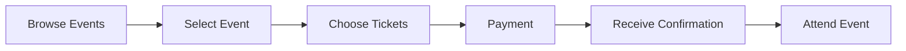

### 2. Designer Flow
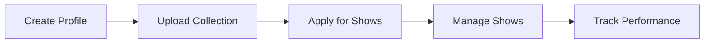

### 3. Admin Flow


## Database Structure

### Core Tables Overview
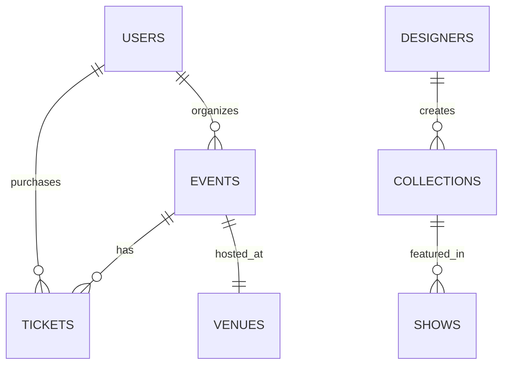

## Additional System Flows

### Authentication Flow
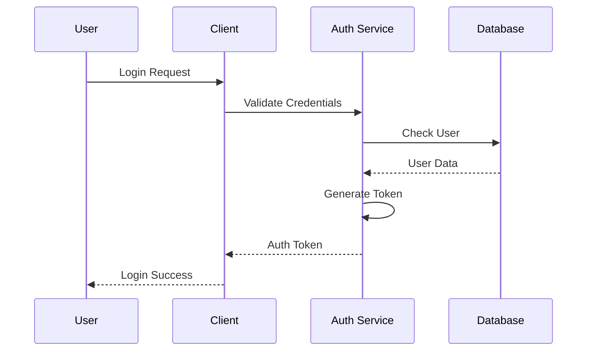

### Payment Processing Flow
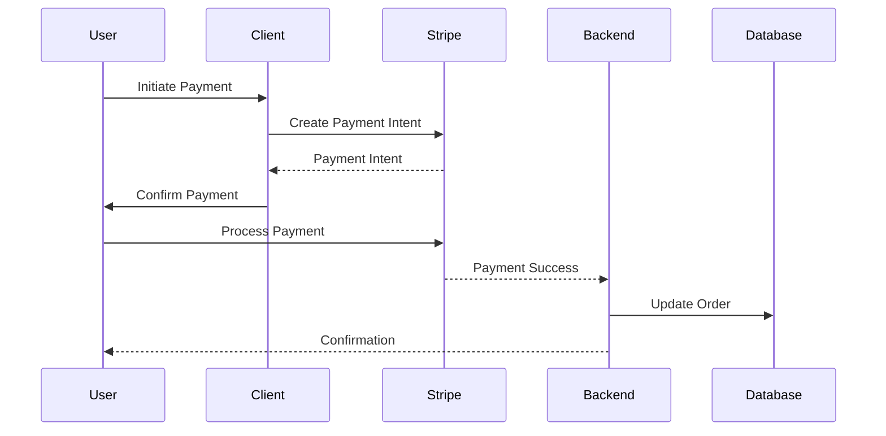

### Event Creation Flow
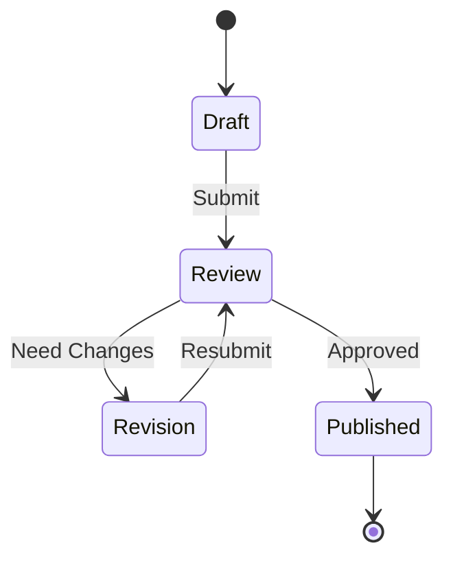

### Media Upload Flow
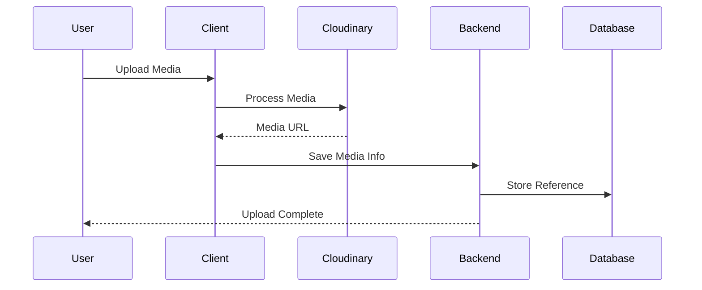

### Notification System
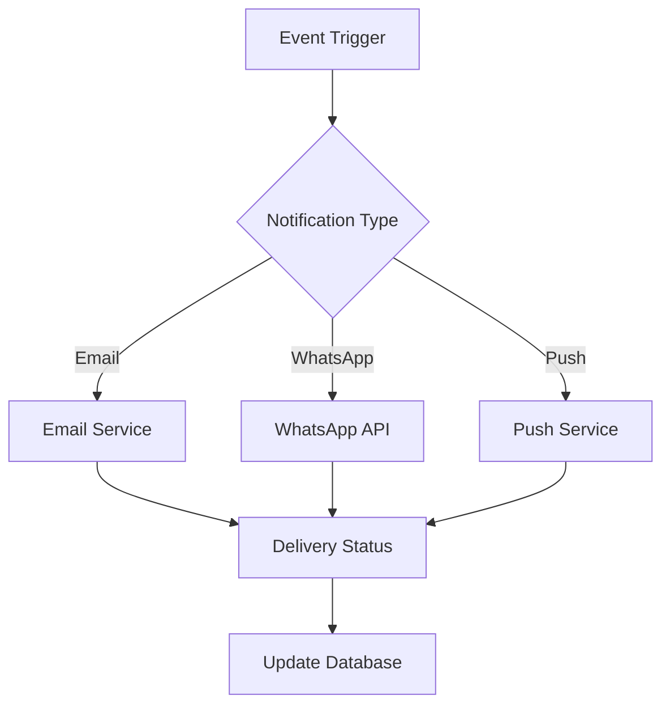

### Cache Strategy
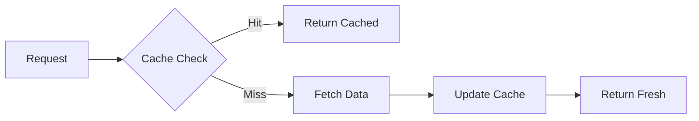

### Monitoring System
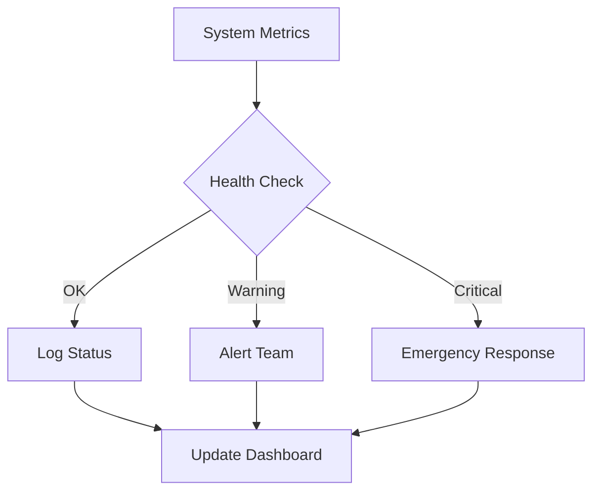

### Backup Process
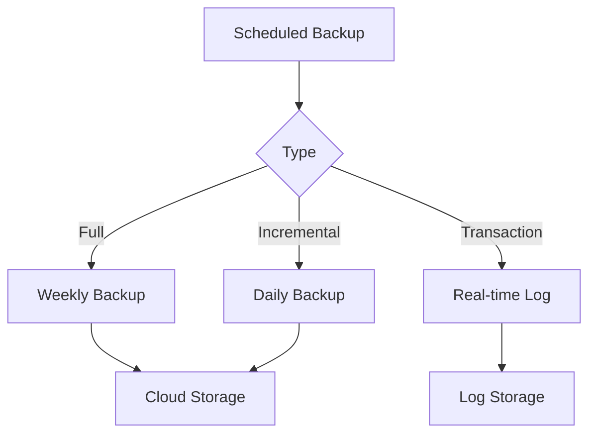

Remember: These diagrams provide visual representations of the core system flows and architecture. They should be used in conjunction with the main documentation for a complete understanding of the system. 