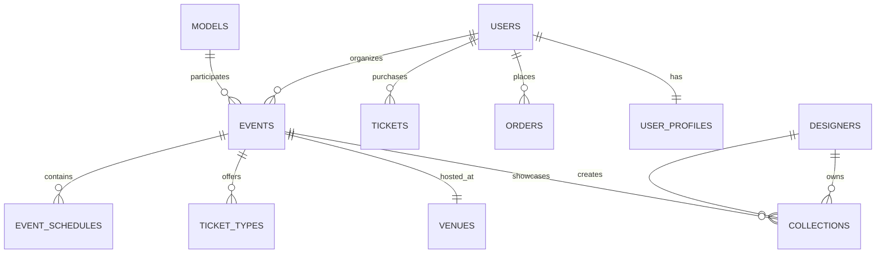

# Fashionista Portal - Core Database Structure

## Overview
This document outlines the essential database structure for the Fashionista Portal, detailing how different types of data are organized and connected. The structure is designed to be scalable, efficient, and secure.

## Core Tables

### Users
- **users**
  - id (UUID, primary key)
  - email (string, unique)
  - password_hash (string)
  - full_name (string)
  - phone_number (string)
  - user_type (enum: admin, organizer, designer, model, attendee)
  - status (enum: active, inactive, pending)
  - created_at (timestamp)
  - updated_at (timestamp)
  - last_login (timestamp)
  - profile_image_url (string)
  - preferences (jsonb)

- **user_profiles**
  - id (UUID, primary key)
  - user_id (UUID, foreign key)
  - bio (text)
  - social_links (jsonb)
  - company (string)
  - position (string)
  - location (string)
  - preferences (jsonb)

### Events
- **events**
  - id (UUID, primary key)
  - organizer_id (UUID, foreign key)
  - title (string)
  - description (text)
  - start_date (timestamp)
  - end_date (timestamp)
  - venue_id (UUID, foreign key)
  - status (enum: draft, published, cancelled, completed)
  - capacity (integer)
  - type (enum: fashion_show, exhibition, workshop)
  - created_at (timestamp)
  - updated_at (timestamp)
  - meta_data (jsonb)

- **event_schedules**
  - id (UUID, primary key)
  - event_id (UUID, foreign key)
  - title (string)
  - description (text)
  - start_time (timestamp)
  - end_time (timestamp)
  - location (string)
  - type (string)
  - order (integer)

### Venues
- **venues**
  - id (UUID, primary key)
  - name (string)
  - address (string)
  - city (string)
  - country (string)
  - capacity (integer)
  - facilities (jsonb)
  - contact_info (jsonb)
  - meta_data (jsonb)

### Tickets
- **ticket_types**
  - id (UUID, primary key)
  - event_id (UUID, foreign key)
  - name (string)
  - description (text)
  - price (decimal)
  - quantity (integer)
  - benefits (jsonb)
  - sale_start (timestamp)
  - sale_end (timestamp)
  - status (enum: active, inactive, sold_out)

- **tickets**
  - id (UUID, primary key)
  - ticket_type_id (UUID, foreign key)
  - order_id (UUID, foreign key)
  - user_id (UUID, foreign key)
  - status (enum: valid, used, cancelled, refunded)
  - purchase_date (timestamp)
  - qr_code (string)
  - meta_data (jsonb)

### Fashion Industry
- **designers**
  - id (UUID, primary key)
  - user_id (UUID, foreign key)
  - brand_name (string)
  - portfolio_url (string)
  - specialties (array)
  - experience_level (string)
  - achievements (jsonb)
  - meta_data (jsonb)

- **collections**
  - id (UUID, primary key)
  - designer_id (UUID, foreign key)
  - name (string)
  - description (text)
  - season (string)
  - year (integer)
  - status (enum: draft, published, archived)
  - images (jsonb)
  - meta_data (jsonb)

- **models**
  - id (UUID, primary key)
  - user_id (UUID, foreign key)
  - height (decimal)
  - measurements (jsonb)
  - portfolio_url (string)
  - experience_level (string)
  - availability (jsonb)
  - meta_data (jsonb)

### Orders & Payments
- **orders**
  - id (UUID, primary key)
  - user_id (UUID, foreign key)
  - status (enum: pending, completed, cancelled, refunded)
  - total_amount (decimal)
  - payment_status (enum: pending, paid, failed, refunded)
  - created_at (timestamp)
  - updated_at (timestamp)
  - meta_data (jsonb)

- **payments**
  - id (UUID, primary key)
  - order_id (UUID, foreign key)
  - amount (decimal)
  - payment_method (string)
  - status (enum: pending, successful, failed)
  - transaction_id (string)
  - created_at (timestamp)
  - meta_data (jsonb)

### Marketing & Communication
- **campaigns**
  - id (UUID, primary key)
  - name (string)
  - description (text)
  - start_date (timestamp)
  - end_date (timestamp)
  - status (enum: draft, active, completed)
  - type (enum: email, social, push)
  - meta_data (jsonb)

- **notifications**
  - id (UUID, primary key)
  - user_id (UUID, foreign key)
  - type (enum: email, sms, push)
  - title (string)
  - content (text)
  - status (enum: pending, sent, failed)
  - sent_at (timestamp)
  - meta_data (jsonb)

### System & Monitoring
- **audit_logs**
  - id (UUID, primary key)
  - user_id (UUID, foreign key)
  - action (string)
  - entity_type (string)
  - entity_id (UUID)
  - changes (jsonb)
  - ip_address (string)
  - user_agent (string)
  - created_at (timestamp)

- **system_logs**
  - id (UUID, primary key)
  - level (enum: info, warning, error, critical)
  - message (text)
  - context (jsonb)
  - stack_trace (text)
  - created_at (timestamp)

- **performance_metrics**
  - id (UUID, primary key)
  - metric_type (string)
  - value (decimal)
  - timestamp (timestamp)
  - context (jsonb)
  - tags (array)

### Cache Management
- **cache_entries**
  - key (string, primary key)
  - value (jsonb)
  - expiration (timestamp)
  - last_accessed (timestamp)
  - hit_count (integer)
  - metadata (jsonb)

### Session Management
- **sessions**
  - id (UUID, primary key)
  - user_id (UUID, foreign key)
  - token (string)
  - ip_address (string)
  - user_agent (string)
  - last_activity (timestamp)
  - expires_at (timestamp)
  - data (jsonb)

### Integration Management
- **external_services**
  - id (UUID, primary key)
  - name (string)
  - type (string)
  - config (jsonb)
  - status (enum: active, inactive, error)
  - last_check (timestamp)
  - health_status (jsonb)

- **integration_logs**
  - id (UUID, primary key)
  - service_id (UUID, foreign key)
  - event_type (string)
  - status (enum: success, failure)
  - request_data (jsonb)
  - response_data (jsonb)
  - created_at (timestamp)

### Data Versioning
- **version_control**
  - id (UUID, primary key)
  - entity_type (string)
  - entity_id (UUID)
  - version (integer)
  - data (jsonb)
  - created_by (UUID, foreign key)
  - created_at (timestamp)
  - comment (text)

## Key Relationships

## Data Security & Privacy
- All personal data is encrypted at rest
- Passwords are hashed using industry-standard algorithms
- Access control is implemented at the database level
- Regular backups are maintained
- Audit logs track all data modifications

## Best Practices
1. Always use prepared statements for queries
2. Implement proper indexing for frequently accessed fields
3. Use transactions for related operations
4. Regularly backup and verify data integrity
5. Monitor query performance and optimize as needed

## Maintenance Guidelines
1. Regular backup schedule
2. Index optimization
3. Query performance monitoring
4. Data archival strategy
5. Scaling considerations

Remember: This database structure is designed to be:
- Scalable for future growth
- Secure for sensitive data
- Efficient for common operations
- Flexible for feature additions
- Compliant with data protection regulations 

## Caching Strategy

### Cache Levels
1. Application Cache
   - In-memory cache for frequent data
   - Session data caching
   - User preferences caching
   - System settings cache

2. Database Cache
   - Query result caching
   - Prepared statement cache
   - Schema cache
   - Connection pool

3. Content Cache
   - Static asset caching
   - API response cache
   - Page component cache
   - Image cache

### Cache Invalidation
1. Time-based Invalidation
   - Set expiration times
   - Sliding expiration
   - Absolute expiration
   - Custom schedules

2. Event-based Invalidation
   - Data update triggers
   - Manual purge options
   - Dependency tracking
   - Cascade invalidation

## Backup & Recovery

### Backup Types
1. Full Database Backup
   - Daily full backup
   - Weekly archival
   - Monthly long-term storage
   - Verification process

2. Incremental Backup
   - Hourly changes
   - Transaction logs
   - Differential backups
   - Point-in-time recovery

3. System State Backup
   - Configuration files
   - Environment settings
   - Security certificates
   - Custom settings

### Recovery Procedures
1. Standard Recovery
   - Backup verification
   - System preparation
   - Data restoration
   - Integrity checks

2. Point-in-time Recovery
   - Transaction log analysis
   - Recovery point selection
   - Data reconstruction
   - Verification steps

3. Emergency Recovery
   - Critical data priority
   - Minimal downtime
   - Service restoration
   - Validation process

## Performance Optimization

### Indexing Strategy
1. Primary Indexes
   - Clustered indexes
   - Primary key optimization
   - Unique constraints
   - Foreign key indexes

2. Secondary Indexes
   - Covering indexes
   - Composite indexes
   - Filtered indexes
   - Include columns

3. Special Indexes
   - Full-text search
   - Spatial indexes
   - JSON indexes
   - Custom indexes

### Query Optimization
1. Query Plans
   - Plan caching
   - Plan optimization
   - Statistics updates
   - Parameter sniffing

2. Data Access
   - Connection pooling
   - Batch processing
   - Lazy loading
   - Eager loading

## Data Archival

### Archival Strategy
1. Data Classification
   - Active data
   - Warm storage
   - Cold storage
   - Archive storage

2. Retention Policies
   - Legal requirements
   - Business needs
   - Storage optimization
   - Cost management

3. Archive Process
   - Data selection
   - Compression
   - Verification
   - Cataloging

### Access Management
1. Archive Access
   - Read-only access
   - Recovery procedures
   - Search capabilities
   - Access logging

2. Maintenance
   - Integrity checks
   - Format updates
   - Storage optimization
   - Access verification

## Security Measures

### Data Protection
1. Encryption
   - At-rest encryption
   - In-transit encryption
   - Key management
   - Rotation policies

2. Access Control
   - Row-level security
   - Column-level security
   - Dynamic data masking
   - Always Encrypted

### Audit System
1. Activity Monitoring
   - User actions
   - System changes
   - Data access
   - Security events

2. Compliance Tracking
   - GDPR requirements
   - Data privacy
   - Security standards
   - Industry regulations

Remember: This database structure is designed to be:
- Highly available
- Disaster resistant
- Performance optimized
- Security focused
- Easily maintainable
- Fully auditable
- Efficiently scalable
- Compliance ready 