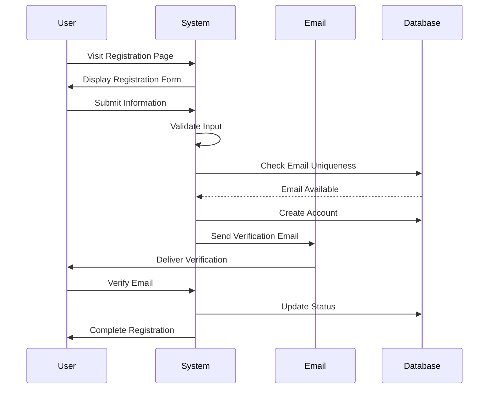
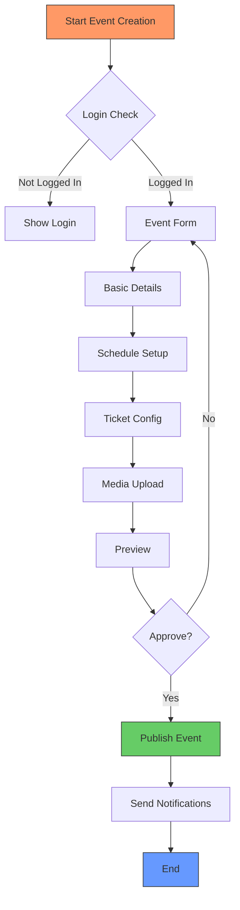
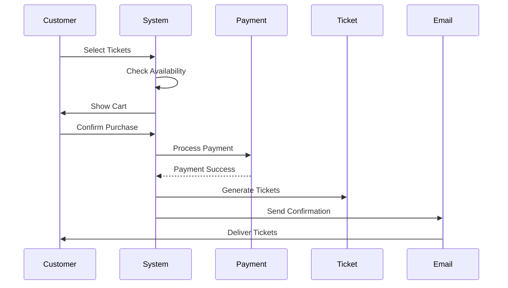
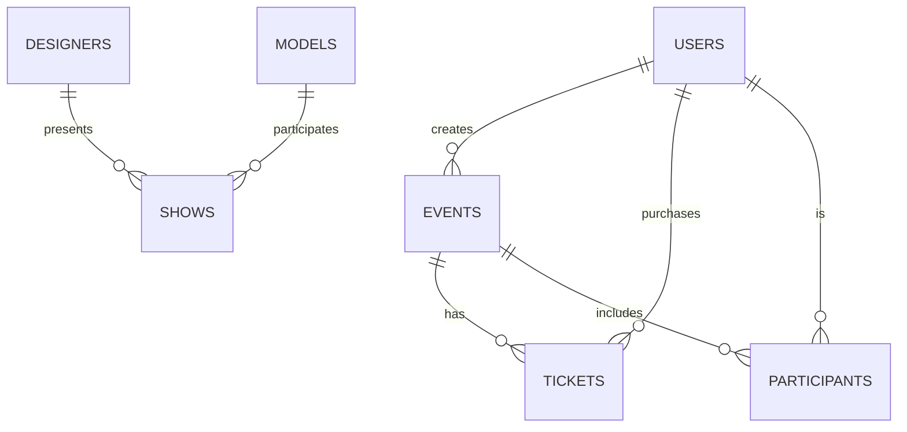
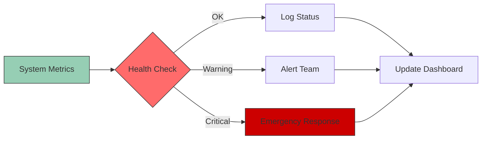
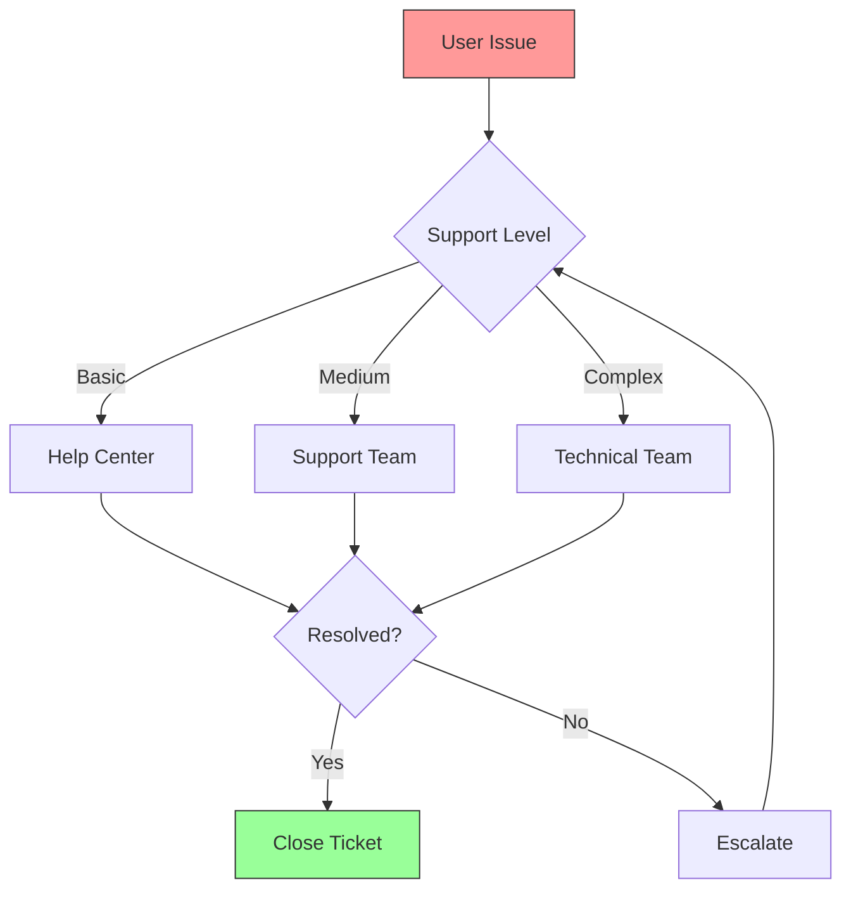
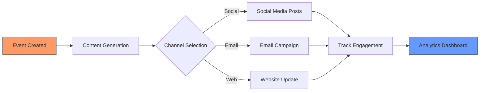
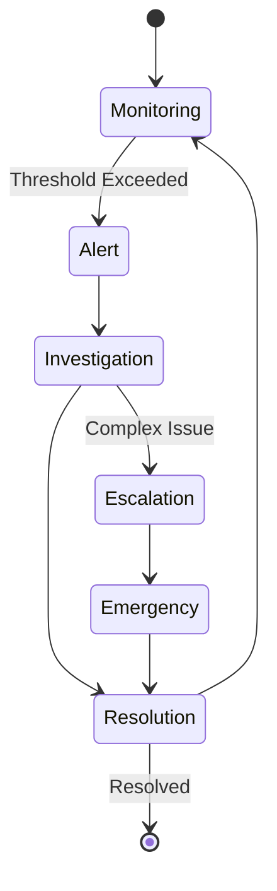

# Fashionista Portal - Core Roadmap Diagrams

## Core System Overview

```mermaid
graph TB
    A[Fashionista Portal] --> B[User Management]
    A --> C[Event Management]
    A --> D[Ticket System]
    A --> E[Fashion Features]
    A --> F[Marketing]
    A --> G[Support]

    B --> B1[Registration]
    B --> B2[Authentication]
    B --> B3[Security]

    C --> C1[Event Creation]
    C --> C2[Event Control]
    C --> C3[Scheduling]

    D --> D1[Ticket Setup]
    D --> D2[Purchase Flow]
    D --> D3[Inventory]

    E --> E1[Designer Portal]
    E --> E2[Model Management]
    E --> E3[Show Management]

    F --> F1[Social Media]
    F --> F2[Email Marketing]
    F --> F3[Analytics]

    G --> G1[Help Center]
    G --> G2[Training]
    G --> G3[Support]

    style A fill:#f9f,stroke:#333,stroke-width:4px
    style B,C,D fill:#ff6b6b,stroke:#333,stroke-width:2px
    style E,F,G fill:#4ecdc4,stroke:#333,stroke-width:2px
```

## User Registration Flow

## Event Creation Process

## Ticket Purchase Flow

## Database Relationships

## System Monitoring Flow

## Launch Day Timeline

```mermaid
gantt
    title Launch Day Schedule
    dateFormat  HH:mm
    axisFormat %H:%M
    
    section System
    Database Update      :08:00, 30m
    System Deployment    :08:30, 1h
    Security Checks      :09:30, 30m
    
    section Verification
    Core Features       :10:00, 1h
    User Testing        :11:00, 1h
    
    section Launch
    Go Live            :12:00, 30m
    Monitor            :12:30, 8h
```

## Support Process Flow

## Marketing Integration

## Performance Monitoring

Remember: These diagrams provide visual representations of our core processes. They should be used alongside the written documentation for better understanding of the system flows and relationships. 